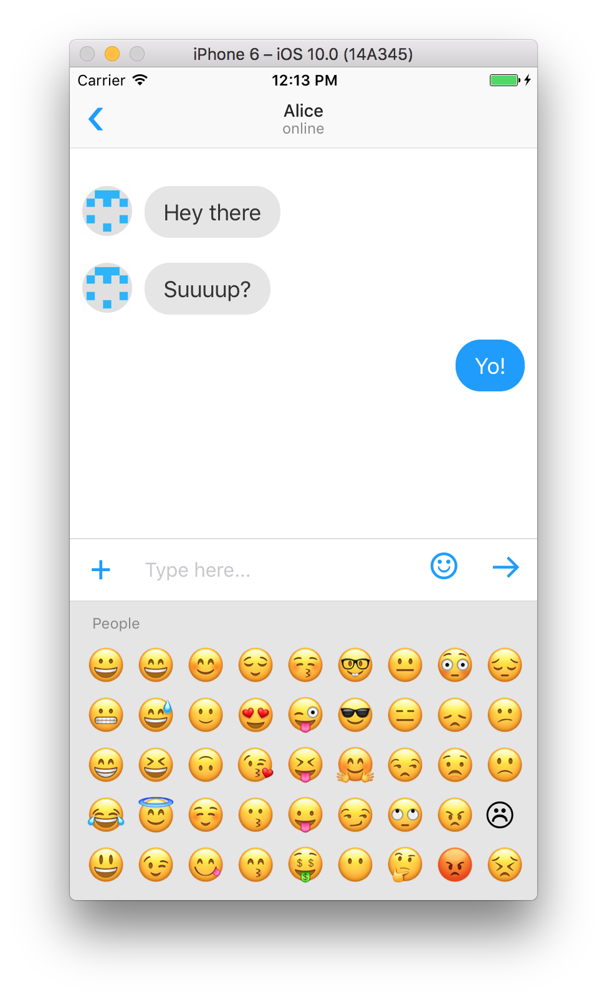

# `<EmojiPicker />`

## Quick demo



```javascript
<EmojiPicker
  onPick={emoji => {}}
/>
```

## Install

```
npm install --save react-native-simple-emoji-picker
```

```javascript
import EmojiPicker from 'react-native-simple-emoji-picker';
```

## Usage

## `<EmojiPicker />` component

Props:

* `onPick` (optional): a callback that is fired when the emoji is pressed.
* `headerStyle` (optional): the style object to be applied to category headers.
* `containerHeight`: the height of the picker. Defaults to `240`.
* `containerBackgroundColor`: the background color of the picker. Defaults to `rgba(0, 0, 0, 0.1)`.
* `emojiSize`: the size of the individual emoji item. Defaults to `40`.

## To Do

* performance
* accessibility

## License

MIT.
